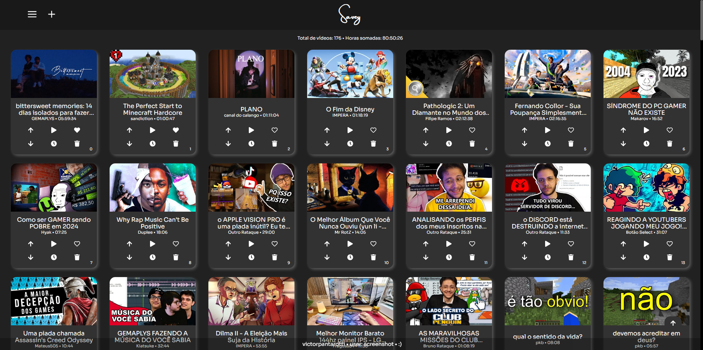

# Savey

A Simple Website and Android App to save Youtube Videos to watch later!
##### The actual app/website is in Brazillian Portuguese*



<br />

## Functions:

- Save videos from Youtube;
- Save and set the exact time you stopped watching;
- Search by duration, title and channel;
- Favorites list;
- Shortcut to add videos (CTRL + Space or CTRL + Q);
- Shortcut to search (CTRL + K);
- Theme switcher.
<br />

## How to install it:

> First, create a Firebase project and initialize a database:
[Firebase Console](https://console.firebase.google.com/u/0/)

> Next, create a Google Cloud project and generate an API key for the YouTube Data API v3:
[Google Cloud Console](console.cloud.google.com/welcome)

> Then, create a `.env` file and add all your credentials:
```
VITE_FIREBASE_API_KEY=<YOUR_FIREBASE_API_KEY>
VITE_FIREBASE_AUTH_DOMAIN=<YOUR_FIREBASE_AUTH_DOMAIN>
VITE_FIREBASE_DATABASE_URL=<YOUR_FIREBASE_DATABASE_URL>
VITE_FIREBASE_PROJECT_ID=<YOUR_FIREBASE_PROJECT_ID>
VITE_FIREBASE_STORAGE_BUCKET=<YOUR_FIREBASE_STORAGE_BUCKET>
VITE_FIREBASE_MESSAGING_SENDER_ID=<YOUR_FIREBASE_MESSAGING_SENDER_ID>
VITE_FIREBASE_APP_ID=<YOUR_FIREBASE_APP_ID>

VITE_YOUTUBE_API_KEY=<YOUR_YOUTUBE_API_KEY>

VITE_ENCRYPTION_SECRET=<YOUR_ENCRYPTION_SECRET>
```

> Finally, in your terminal use:
```
npm install
```
```
npm run dev # to run locally
or
npm run host # to run on the local network
or
npx cap run android # to run on android
```

> And you're good to go! :)
<br />

## Notes:

I may not be maintaining this project regularly, but if you encounter any issues, feel free to leave them in the "Issues" section, and (hopefully) I'll see them one day!
<br />
If you use this project, I would appreciate it if you could give proper credit :)

##### made by victorpantarotti